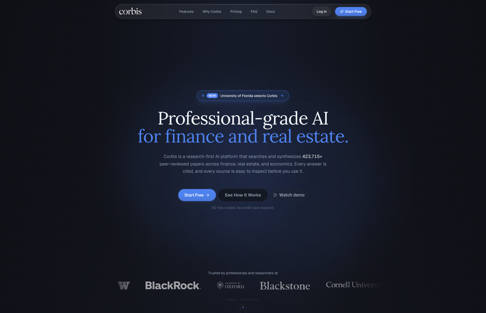
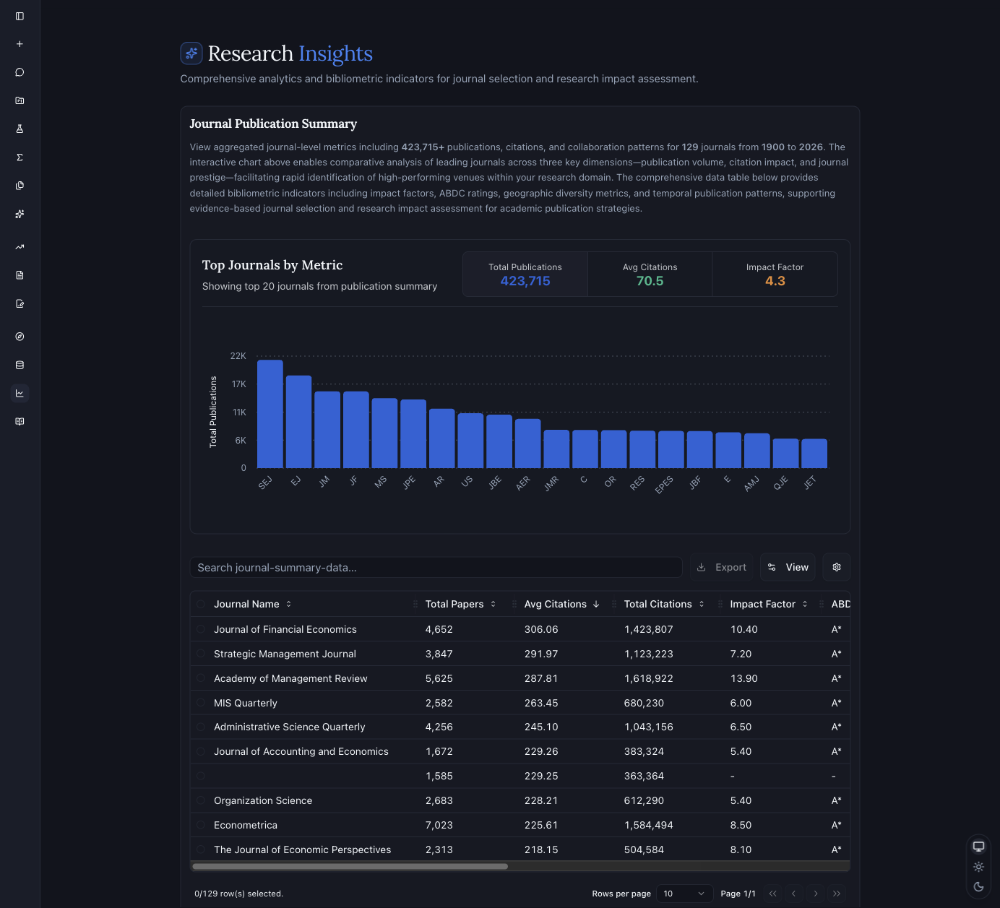
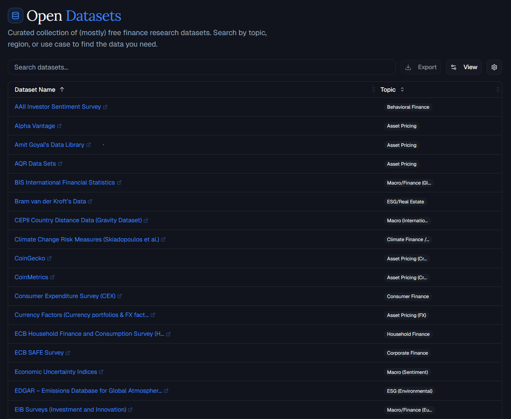

# Corbis MCP

**Peer-reviewed research at the speed of conversation.**

Bring Corbis into a compatible AI workspace for finance, real estate, and
economics research with sources you can inspect.

[Visit Corbis](https://www.corbis.ai/) | [Research Insights](https://www.corbis.ai/insights) | [Open Datasets](https://www.corbis.ai/datasets)

---

[corbis.ai](https://www.corbis.ai/)

## Research You Can Stand Behind

[Corbis](https://www.corbis.ai/) is a research-first AI platform for finance,
real estate, and economics. It provides cited answers and links back to the
research behind them, so you can review the evidence before you use it.

## Bring Corbis Into an AI Workspace

This connector is designed to help a compatible AI workspace reach Corbis. If
Corbis is available in a workspace, select it and follow the Corbis sign-in
prompts. Availability and research access depend on the workspace and
signed-in account. The source package does not itself provide access or
guarantee a client connection, so this page stays focused on what Corbis helps
you do rather than a static technical tool list.

## Explore Corbis

### Research Insights

Journal-level publication statistics, bibliometrics, and a corpus overview in
the Corbis research database.

[corbis.ai/insights](https://www.corbis.ai/insights)

### Open Datasets

Corbis hosts a curated collection of mostly free finance research datasets.
Browse by topic, region, or use case to find relevant data.

[corbis.ai/datasets](https://www.corbis.ai/datasets)

### Cited Research, Where You Work

Ask research questions in the workspace you already use, then follow the
citations back to the underlying materials. Corbis controls access to the
research capabilities for the signed-in account and keeps credentials out of this
repository.

## Help and Security

Need help with Corbis? Contact
[corbis@agenticassets.ai](mailto:corbis@agenticassets.ai). To report a
security issue privately, follow [SECURITY.md](SECURITY.md). Please do not
send credentials, tokens, or client data through either route.

---

**Built by [Corbis](https://www.corbis.ai/) from [Agentic Assets](https://www.agenticassets.ai/)**

[corbis.ai](https://www.corbis.ai/) | [Research Insights](https://www.corbis.ai/insights) | [Open Datasets](https://www.corbis.ai/datasets)

